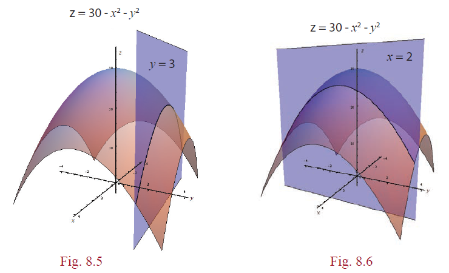



---
## Functions of Several Variables
---
&emsp;&emsp;Recall that given a function \\(f\\) of \\(x\\) ; we sketch the graph of \\(y = f (x)\\) to understand it better. Generally, the graph of \\(y = f (x)\\) gives a curve in the \\(xy\\)-plane. Also, the derivative \\(f ′(a)\\) of \\(f\\) at \\(x = a\\) represents the slope of the tangent at \\(x = a\\) , to the graph of \\(f\\). In the introduction we have seen
the need for considering functions of more than one variable. Here we shall develop some concepts to understand functions of more than one variable. First we shall consider functions of two variables. Let \\(F(x, y)\\) be a function of \\(x\\) and \\(y\\) . To obtain graph \\(F\\) , we graph \\(z = F(x, y)\\) in the \\(xyz\\) -space. Also, we shall develop the concepts of continuity, partial derivatives of a function of two variables.

&emsp;&emsp;Let us look at an example, \\(g(x, y) = 30 − x^{2} − y^{2}\\) , for \\(x, y∈\mathbb{R}\\). Given a point \\((x, y)∈ \mathbb{R}\\), then \\(z = 30 − x^{2} - y^{2}\\) gives the \\(z\\) coordinate of the point on the graph. Thus the point \\((x, y,30 − x^{2} - y^{2}\\) lies 30 − \\(x^{2}−y^{2}\\) high just above the point \\((x, y\\) in \\(xy\\) -plane. For instance, for \\((2,3) ∈ \mathbb{R^{2}}\\), the point
\\(2,3,30-2^{2}-3^{2}=(2,3,17)\\) lies on the graph of \\(g\\) . If we fix the value \\(y = 3\\), then \\(g(x,3)= −x^{2}+21\\)
**which is a function that depends only on** \\(x\\) variable; so its graph must be a curve. Similarly, if we fix
value \\(x = 2\\) , then we have \\(g(2,y)= 26-y^{2}\\) which is a function that depends only on \\(y\\) . In each case
the graph, as the resulting function being quadratic, will be a parabola. The surface we obtain from
\\(z = g(x, y)\\) is called **paraboloid**.

&emsp;&emsp;Note that \\(g(x,3) = 21 - x^{2}\\) represents a parabola; which is obtained by intersecting the surface of
\\(z = 30 − x^{2} − y^{2}\\) with the plane \\(y = 3\\) [see Fig. 8.5). Similarly \\(g(2,y) = 26 − y^{2}\\) represents a parabola;
which is obtained by intersecting the surface of \\(z = 30 − x^{2} − 
y^{2}\\) with the plane \\(x = 2\\) [see Fig. 8.6).
Following graphs describes the above discussion.

&emsp;&emsp;In the same way, given a function \\(F\\) of a two variables say \\(x, y\\) , we can visualize it in the three space by considering the equation \\(z = F(x, y)\\). Generally, this will represent a surface in \\(\mathbb{R^{3}}\\).

### Recall of Limit and Continuity of Functions of One Variable

&emsp;&emsp;Next we shall look at continuity of a function of two variables. Before that, it will be beneficial for us to recall the continuity of a function of single variable. We have seen the following definition of continuity in XI Std.

&emsp;A function \\(f : (a,b)→\mathbb{R}\\) is said to be continuous at a point \\(x_{0}∈(a,b)\\) if the following hold:

(1) \\(f\\) is defined at \\(x_{0}\\). &emsp;&emsp;
(2) \\(\lim_{x->x_{0}} f(x)=L\\) exists &emsp;&emsp; (3) \\(L=f(x_{0})\\)

&emsp;&emsp;The key idea in the continuity lies in understanding the second condition given above. We write \\(\lim_{x->x_{0}} f(x)=L\\) whenever the value \\(f(x)\\) gets closer and closer to \\(L\\) as \\(x\\) gets closer and closer to \\(x_{0}\\).

&emsp;&emsp;To make it clear and precise, let us rewrite the second condition in terms of neighbourhoods. This
will help us when we talk about continuity of functions of two variables.

---
Definition 8.5 (Limit of a Function)
&emsp; 

Suppose that \\(f : (a,b)→\mathbb{R}\\) and \\(x_{0}∈(a,b)\\). We say that \\(f\\) has a limit \\(L\\) at \\(x=x_{0}\\) if for every neighbourhood \\((L-\varepsilon,L+\varepsilon),\varepsilon>0\\) of \\(L\\), there exists a neighbourhood \\((x_{0}-\delta,x_{0}+\delta)\subset (a,b),\delta>0\\) of \\(x_{0}\\) such that

\\(f(x)∈(L-\varepsilon,L+\varepsilon)\\) whenever \\(x∈(x_{0}-\delta,x_{0}+\delta)\\)\\\\(\\{x_{0}\\}\\)

--- 

&emsp;&emsp;The above condition in terms of neighbourhoods can also be equivalently stated using modulus (or absolute value) notation as follows:

\\(\forall \varepsilon >0,\exists \delta >0\\) such that \\(| f(x)-L|<\varepsilon\\) whenever \\(0<|x-x_{0}|<\delta\\).

&emsp;&emsp;This means whenever \\(x \neq x_{0}\\)  and is within \\(\delta \\) distance from \\(x_{0}\\), then \\(f(x)\\) is within \\(\varepsilon \\) distance
from \\(L\\) . Following figures explain the interplay between \\(\varepsilon \\) and \\(\delta \\).

&emsp;&emsp;We also know, from XI Std, that a function \\(f\\) defined in the neighbourhood of \\(x_{0}\\) except possibly
at \\(x_{0}\\) has a limit at \\(x_{0}\\) if the following hold : 

(1) \\(\lim_{x->x_{0}} f(x)=L_{1}\\) (right hand limit) exists &emsp;&emsp; (2) \\(\lim_{x->x_{0}} f(x)=L_{2}\\) (left hand limit) exists &emsp;&emsp;
(3) \\(L_{1}=L_{2}\\).

&emsp;&emsp;Let \\(f(x_{0}=L)\\) (say). Then the function \\(f\\) is continuous at x= \\(x_{0}\\) if L = \\(L_{1} = L_{2}\\).Note that in the limit and continuity of a single variable functions, neighbourhoods play an important role. In this case a neighbourhood of a point \\(x_{0}∈\mathbb{R}\\) looks like \\((x_{0}-r,x_{0}+r)\\), where \\(r\\)>0. In order to develop limit and continuity of functions of two variables, we need to define neighbourhood of a point \\((u,v)∈\mathbb{R^{2}}\\). So, for \\((u,v)∈\mathbb{R^{2}}\\) and \\(r\\)>0, a \\(r\\)-neighbourhood of the point \\((u,v)\\) is the set

&emsp;&emsp;&emsp;&emsp;\\(B_{r}((u,v)\\))={\\({(x,y)∈\mathbb{R^{2}}}|(x-u)^{2}+(y-v)^{2}<r^{2}\\)}.

&emsp;&emsp;So a \\(r\\)-neighbourhood of a point \\((u,v)\\) is an open disc with centre \\((u,v)\\) and radius \\(r\\)>0. If the centre is removed from the neighbourhood, then it is called a **deleted neighbourhood**.
